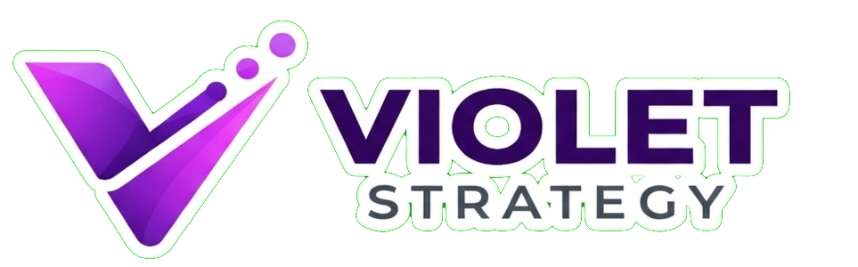

# 🤖 Violet Strategy - Landing Page con IA

<div align="center">




<p align="center">
  <br />
  <a href="https://violet-strategy.vercel.app/">
    
  </a>
</p>

</div>

---

## 📖 Descripción del Proyecto

Este proyecto consiste en el desarrollo de una landing page moderna para una agencia de marketing digital ficticia llamada **Violet Strategy**, construida con tecnologías modernas del ecosistema React.

La característica principal del proyecto es la integración de un **chatbot impulsado por Inteligencia Artificial mediante la API de Gemini**, diseñado para interactuar con los visitantes del sitio y proporcionar información contextual sobre los servicios, la empresa y el contenido disponible dentro de la plataforma.

El asistente comprende consultas en lenguaje natural, mantiene el contexto conversacional y limita sus respuestas exclusivamente a la información relacionada con el negocio.

---

## 🎯 Objetivos del Proyecto

* 🤖 Integrar Inteligencia Artificial en una experiencia web real.
* 🎨 Crear una interfaz moderna y atractiva para una agencia digital.
* ⚡ Implementar una arquitectura basada en componentes reutilizables.
* 📱 Garantizar una experiencia responsive en cualquier dispositivo.
* 🧠 Aplicar procesamiento de lenguaje natural mediante Gemini.
* 🚀 Utilizar buenas prácticas de desarrollo con Next.js y TypeScript.

---

## ✨ Características Principales

* 🤖 Chatbot con IA integrado mediante Gemini API.
* 💬 Comprensión de lenguaje natural y respuestas contextualizadas.
* 🎨 Interfaz moderna con animaciones utilizando Framer Motion.
* 📱 Diseño responsive para móviles, tablets y escritorio.
* 🌙 Soporte para modo oscuro.
* ♻️ Arquitectura basada en componentes reutilizables.
* ⚡ Desarrollado con Next.js, TypeScript y Tailwind CSS.

---

## 🛠️ Tecnologías Utilizadas

<p align="left">
  
  
  
  
  
  
  
  
</p>

---

## 📂 Arquitectura del Proyecto

```text
src/
│
├── app/                      # Configuración principal de rutas y layout
│   ├── layout.tsx            # Estructura global de la aplicación
│   ├── page.tsx              # Página principal
│   └── api/
│       └── chat/             # Endpoint para comunicación con Gemini AI
│
├── components/
│   ├── Navbar.tsx            # Barra de navegación
│   ├── Hero.tsx              # Sección principal de bienvenida
│   ├── Services.tsx          # Servicios de la agencia
│   ├── Portfolio.tsx         # Portafolio de proyectos
│   ├── About.tsx             # Información corporativa
│   ├── Testimonials.tsx      # Testimonios de clientes
│   ├── Contact.tsx           # Formulario de contacto
│   ├── ChatbotIA.tsx         # Chatbot inteligente integrado
│   └── Footer.tsx            # Pie de página
│
├── public/                   # Recursos estáticos
│   ├── logo.png              # Logotipo del proyecto
│   └── assets/               # Imágenes y recursos gráficos
│
└── styles/                   # Estilos globales y configuraciones visuales
```

---

## 🧠 Funcionamiento del Chatbot

El chatbot funciona como un asistente virtual especializado en la información de Violet Strategy.

### Flujo de funcionamiento

1. El usuario envía una consulta.
2. La aplicación procesa el mensaje recibido.
3. La solicitud es enviada a Gemini API.
4. La IA analiza el contexto de la conversación.
5. Se genera una respuesta relevante.
6. La respuesta es mostrada dentro de la interfaz del chatbot.

El sistema está configurado para mantener el enfoque en los servicios, información corporativa y contenido relacionado con la empresa.

---

## 🚀 Instalación y Uso

### 🔹 Clonar repositorio

```bash
git clone https://github.com/TU-USUARIO/violet-strategy.git
```

### 🔹 Ingresar al proyecto

```bash
cd violet-strategy
```

### 🔹 Instalar dependencias

```bash
npm install
```

### 🔹 Configurar variables de entorno

Crear un archivo:

```env
.env.local
```

Agregar:

```env
GEMINI_API_KEY=TU_API_KEY
```

### 🔹 Ejecutar en desarrollo

```bash
npm run dev
```

Abrir en el navegador:

```text
http://localhost:3000
```

---

## 🌐 Despliegue

El proyecto puede desplegarse fácilmente en plataformas compatibles con Next.js como:

* Vercel
* Netlify
* Railway

La aplicación se encuentra disponible en:

👉 https://violet-strategy.vercel.app/

---

## 👨‍💻 Autor

### A. Diego

* GitHub: https://github.com/Alvaro-Diego-MQ

---

## ⚠️ Aviso

Este proyecto fue desarrollado con fines educativos y de práctica profesional para demostrar la integración de Inteligencia Artificial conversacional dentro de una aplicación web moderna construida con Next.js.
